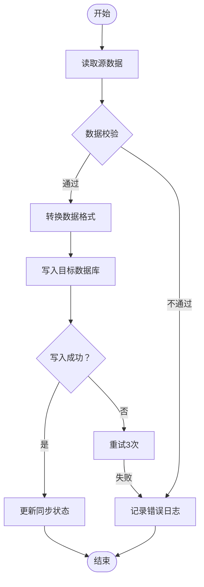
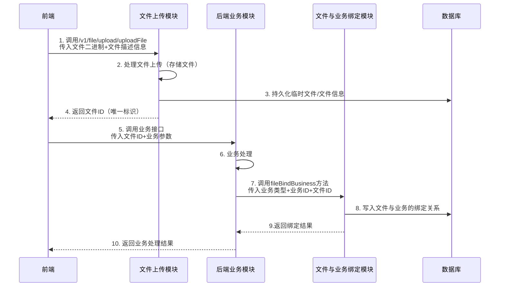
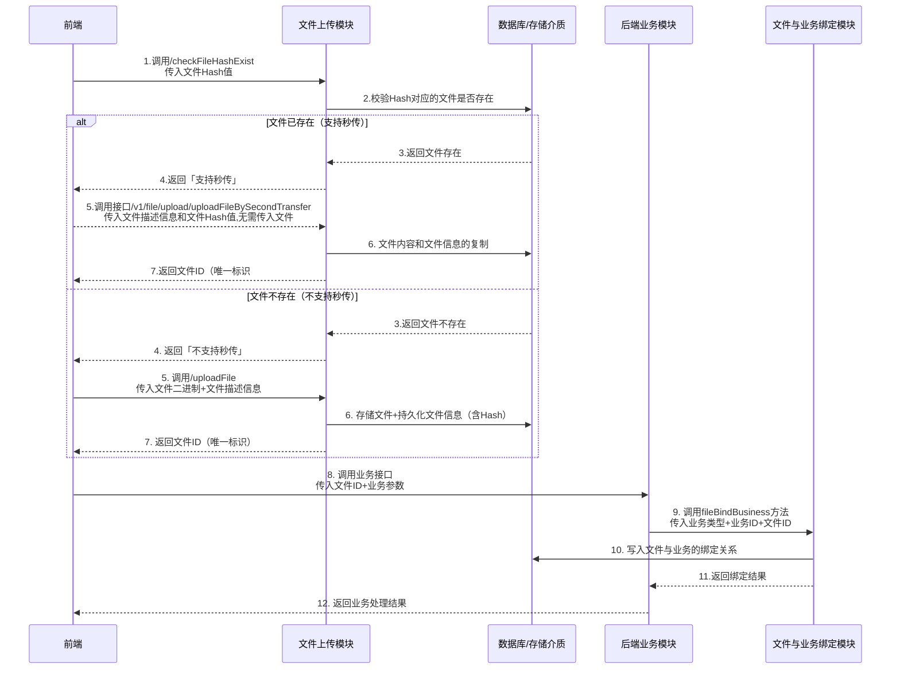
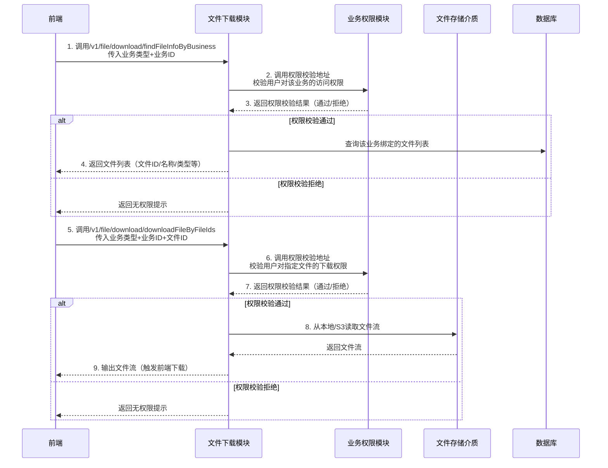

### 文件上传与下载的 包

# 工程简介

    本包聚焦 Web 场景下的文件上传与下载能力封装，核心价值体现在三方面： 
    1. 标准化：规范文件上传 / 下载的流程范式（含校验、秒传等）；
    2. 接口统一：定义通用的文件上传下载接口，上层业务无需感知底层存储细节；
    3. 存储适配：屏蔽本地磁盘、对象存储（S3/MinIO）、分布式文件系统等不同存储的接入差异，支持灵活切换存储实现。

# 使用方式

1.引入jar包

```
<dependency>
     <groupId>cn.bbwres</groupId>
     <artifactId>biscuit-web-file-boot-starter</artifactId>
     <version>${project.version}</version>
 </dependency>
```

使用方法：

1. 首先实现接口FileInfoOperation的方法 用于保存临时文件信息和文件信息，该信息需要保存在数据库中
2. 配置当前使用的文件存储方式，默认支持本地存储和s3存储，用户可以自行扩展其他存储
3. 提供默认的文件与业务操作类，用来将文件信息与业务信息进行绑定。包含了文件与业务的绑定，文件绑定的业务变更（用于将原文件绑定到新业务上），文件绑定复制（用于将原业务关联的附件
   复制到新的业务上），根据业务id删除附件（支持删除单个或者多个）等功能

文件上传业务流程为：

1. 前端调用接口/v1/file/upload/uploadFile传入文件信息和文件描述信息
2. 文件上传处理之后会返回前端当前文件的id。
3. 前端调用后端业务模块的接口并传入文件id。
4. 后端业务模块根据当前业务的业务类型和业务id以及文件id调用cn.bbwres.biscuit.web.file.api.FileBusinessOperation.fileBindBusiness将文件与业务信息进行的绑定

文件下载业务流程为

1. 前端调用接口/v1/file/download/findFileInfoByBusiness接口传入业务类型和业务id获取文件列表
2. 该模块会调用预先配置好的业务模块权限校验地址，对当前用户是否拥有当前文件的权限进行校验。
3. 校验完成则返回文件列表信息给前端。
4. 前端调用接口/v1/file/download/downloadFileByFileIds 传入业务类型、业务id和文件id。
5. 该模块同样调用预先配置好的业务模块权限校验地址，对当前用户是否拥有当前文件的权限进行校验。
6. 校验完成则输出要下载的文件流信息给到前端用户



# 文件上传与下载基础模块使用文档

## 一、模块概述

本模块是面向 Web 场景的文件上传与下载基础组件，标准化文件上传/下载全流程，定义统一接口规范，屏蔽本地存储、S3
存储等不同存储介质的底层差异；同时提供文件与业务信息绑定的核心能力，支持权限校验、文件-业务关联管理等场景，可快速集成到各类
Web 应用中。

## 二、前置准备

### 1. 核心接口实现

需实现 `FileInfoOperation` 接口，该接口用于将临时文件信息、最终文件信息持久化到数据库中，是模块运行的基础（需保证文件信息的持久化可靠性）。

### 2. 存储方式配置

模块默认支持**本地存储**和 **S3 存储**两种方式，可通过配置指定当前使用的存储类型；若需扩展其他存储（如 MinIO、阿里云 OSS
等），可基于模块提供的扩展接口自定义实现。

### 3. 权限校验地址配置

需预先配置业务模块的权限校验地址，模块在文件下载环节会调用该地址完成用户权限校验，确保文件访问的安全性。

## 三、核心功能说明

模块内置 `文件与业务操作类`，提供文件与业务信息的关联管理能力，核心功能如下：

| 功能项         | 说明                                |
|-------------|-----------------------------------|
| 文件与业务绑定     | 将文件 ID 与业务类型、业务 ID 关联，建立文件-业务映射关系 |
| 文件绑定业务变更    | 将原业务关联的文件重新绑定到新业务上                |
| 文件绑定复制      | 把原业务关联的附件复制绑定到新业务上                |
| 按业务 ID 删除附件 | 支持删除单个/多个与指定业务 ID 关联的文件           |

## 四、使用流程

### 4.1 文件上传流程

#### 流程步骤

1. 前端调用接口 `/v1/file/upload/uploadFile`，传入文件二进制信息、文件描述等参数；
2. 模块完成文件上传处理（存储文件、持久化文件信息），返回唯一的文件 ID 给前端；
3. 前端调用后端业务模块接口，将文件 ID 传入业务接口；
4. 后端业务模块调用 `cn.bbwres.biscuit.web.file.api.FileBusinessOperation.fileBindBusiness` 方法，传入**业务类型、业务
   ID、文件 ID**，完成文件与业务信息的绑定。


#### Mermaid 时序图


### 4.2 文件秒传
#### 流程步骤
1. 前端计算文件 Hash 值（如 MD5/SHA256），调用接口 `/v1/file/upload/checkFileHashExist`，传入文件 Hash 值；
2. 模块校验数据库/存储介质中是否存在该 Hash 对应的文件：
    - 若存在：返回 true - 「支持秒传」；
    - 若不存在：返回 false - 「不支持秒传」；
3. 分支逻辑：
    - 秒传场景：前端调用接口 `/v1/file/upload/uploadFileBySecondTransfer`，传入文件Hash值、文件描述等参数；模块完成文件秒传处理，返回唯一的文件 ID 给前端；
4. 前端调用后端业务模块接口，将文件 ID 传入业务接口；
5. 后端业务模块调用 `cn.bbwres.biscuit.web.file.api.FileBusinessOperation.fileBindBusiness` 方法，传入**业务类型、业务 ID、文件 ID**，完成文件与业务信息的绑定。

#### Mermaid 时序图


### 4.3 文件下载流程

#### 流程步骤

1. 前端调用接口 `/v1/file/download/findFileInfoByBusiness`，传入**业务类型、业务 ID**，获取该业务关联的文件列表；
2. 模块调用预先配置的「业务模块权限校验地址」，校验当前用户是否有权限访问该业务下的文件；
3. 权限校验通过后，模块返回文件列表信息（含文件 ID、文件名、文件类型等）给前端；
4. 前端调用接口 `/v1/file/download/downloadFileByFileIds`，传入**业务类型、业务 ID、文件 ID**，发起文件下载请求；
5. 模块再次调用「业务模块权限校验地址」，校验用户是否有权限下载指定文件；
6. 权限校验通过后，模块从对应存储介质中读取文件流，输出给前端完成下载。

#### Mermaid 流程图



## 五、扩展说明

### 1. 存储方式扩展

模块预留存储扩展接口，若需支持除本地/S3 外的其他存储（如 MinIO、阿里云 OSS），只需实现模块定义的存储操作接口，配置文件中指定自定义存储实现类即可。

### 2. 权限校验扩展

权限校验逻辑由业务模块提供，模块仅通过配置的地址进行调用，可根据业务需求自定义权限校验规则（如基于用户角色、数据范围、业务归属等）。

### 3. 异常处理说明

- 文件上传失败：模块会返回统一的错误码及描述，前端可根据错误信息提示用户（如文件大小超限、格式不支持等）；
- 权限校验失败：下载流程中权限校验不通过时，模块会返回无权限提示，前端需引导用户完成权限验证或提示无访问权限；
- 存储介质异常：若存储服务（如 S3、本地磁盘）不可用，模块会返回存储异常提示，需排查存储服务状态。

## 六、核心接口说明

| 接口路径                                       | 请求方式 | 参数说明                                 | 返回值说明                      |
|--------------------------------------------|------|--------------------------------------|----------------------------|
| `/v1/file/upload/uploadFile`               | POST | 文件二进制流、文件描述、文件类型等                    | 文件 ID（唯一标识）                |
| `/v1/file/download/findFileInfoByBusiness` | GET  | 业务类型（businessType）、业务 ID（businessId） | 文件列表（文件 ID、文件名、文件大小、存储路径等） |
| `/v1/file/download/downloadFileByFileIds`  | GET  | 业务类型、业务 ID、文件 ID（多个用逗号分隔）            | 文件流（附件下载）                  |
| `FileBusinessOperation.fileBindBusiness`   | 方法调用 | 业务类型、业务 ID、文件 ID                     | 绑定结果（成功/失败）                |


